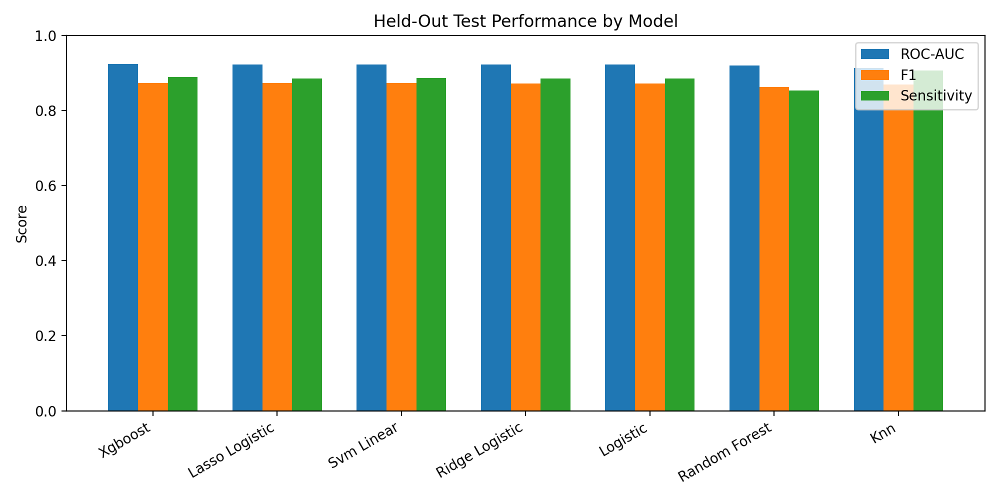

# Student Risk Screening ML Workflow

An end-to-end machine learning workflow for **tabular binary classification**, using the Kaggle Student Depression Dataset as a case study.

This repository is designed as a data-analysis portfolio project. The main purpose is to demonstrate a structured workflow: define the analysis scope, clean ambiguous records, compare models correctly, and interpret predictive signals across model families. It is **not** a clinical or psychological study, and it is not intended to diagnose depression.

## Project Goal

The dataset is used as a case study for a general risk-screening workflow. The transferable skill is the analysis process, not domain expertise in mental health.

```text
Raw data
→ define analysis population
→ clean inconsistent or ambiguous records
→ exploratory data analysis
→ stratified train/test split
→ cross-validation on the training set
→ held-out test evaluation
→ cross-model feature interpretation
→ responsible discussion of limitations
```

This structure is meant to show that a model result is not created by simply applying algorithms. The analysis starts from data definition and ends with an interpretable, reproducible report.

## Responsible Use and Scope

The dataset is treated as a synthetic case-study dataset rather than a clinical survey. Results should be interpreted as **predictive patterns inside this dataset**, not as causal or medical conclusions.

The project avoids claims such as:

- “this factor causes depression”
- “the model diagnoses depression”
- “these results generalize to real clinical populations”

Instead, the project uses safer language:

- predictive signal
- risk-screening style classification
- dataset-level association
- model interpretation

## Data Scope and Cleaning

Before modeling, the analysis defines a clear student-focused population. A small number of records are removed because they are inconsistent with the project scope or have ambiguous values.

| Cleaning rule | Reason |
|---|---|
| Keep only `Profession == Student` | The project is student-focused; non-student records are rare and scope-ambiguous |
| Remove `CGPA == 0` | A zero CGPA is inconsistent with active student academic variables |
| Remove `Degree == Others` | The category is ambiguous and rare |
| Remove invalid `Financial Stress` values such as `?` | The value is not a valid numeric stress score |
| Drop `City` | The project does not perform regional or spatial analysis |
| Drop `id` | Identifier columns should not be predictive features |

The cleaning counts are saved to:

```text
reports/cleaning_report.csv
```

## Exploratory Data Analysis

EDA is used to check target balance and inspect how the risk label varies across selected variables. These charts are descriptive only; they do not imply causality.


## Modeling Strategy

The workflow keeps validation logic strict:

1. Split cleaned data into training and test sets.
2. Use cross-validation and hyperparameter tuning only on the training set.
3. Evaluate selected models once on the held-out test set.

This avoids using the test set for tuning decisions.

## Methods Compared

The project compares both interpretable linear models and flexible machine-learning models:

| Model family | Models | Preprocessing |
|---|---|---|
| Linear / distance / margin models | Logistic Regression, Lasso Logistic, Ridge Logistic, KNN, Linear SVM | numeric imputation + standardization; categorical imputation + one-hot encoding |
| Tree-based models | Random Forest, XGBoost | numeric imputation without standardization; categorical imputation + one-hot encoding |

Logistic regression is intentionally included because it remains competitive and provides readable coefficient directions. Tree-based models are included to compare nonlinear predictive performance and feature importance.

## Evaluation Metrics

The held-out test report includes:

- Accuracy
- ROC-AUC
- PR-AUC
- Sensitivity / Recall
- Specificity
- Precision
- F1 score

Sensitivity is included because false negatives matter in screening-style tasks. This still does not turn the model into a diagnostic tool.

## Results

The strongest held-out ROC-AUC is from **XGBoost** (ROC-AUC = 0.924). The highest sensitivity is from **KNN** (sensitivity = 0.907).

### Held-Out Test Performance

| Model               |   Accuracy |   ROC-AUC |   PR-AUC |   Sensitivity |   Specificity |   Precision |    F1 |
|:--------------------|-----------:|----------:|---------:|--------------:|--------------:|------------:|------:|
| XGBoost             |      0.849 |     0.924 |    0.941 |         0.89  |         0.791 |       0.858 | 0.874 |
| Lasso Logistic      |      0.849 |     0.923 |    0.94  |         0.886 |         0.797 |       0.86  | 0.873 |
| Linear SVM          |      0.849 |     0.923 |    0.94  |         0.887 |         0.795 |       0.859 | 0.873 |
| Ridge Logistic      |      0.848 |     0.922 |    0.94  |         0.885 |         0.796 |       0.86  | 0.872 |
| Logistic Regression |      0.848 |     0.922 |    0.94  |         0.885 |         0.796 |       0.86  | 0.872 |
| Random Forest       |      0.841 |     0.919 |    0.938 |         0.853 |         0.824 |       0.873 | 0.862 |
| KNN                 |      0.84  |     0.913 |    0.925 |         0.907 |         0.746 |       0.834 | 0.869 |




### Training-Set Cross-Validation

| Model               |   Best CV ROC-AUC |   CV Std. | Selected Parameters                                             |
|:--------------------|------------------:|----------:|:----------------------------------------------------------------|
| Lasso Logistic      |             0.921 |     0.002 | {'C': 0.1}                                                      |
| Logistic Regression |             0.921 |     0.003 | {'C': 0.1}                                                      |
| Ridge Logistic      |             0.921 |     0.003 | {'C': 0.1}                                                      |
| Linear SVM          |             0.92  |     0.003 | {'C': 0.1}                                                      |
| XGBoost             |             0.919 |     0.002 | {'learning_rate': 0.05, 'max_depth': 3, 'n_estimators': 150}    |
| Random Forest       |             0.915 |     0.002 | {'max_depth': None, 'min_samples_leaf': 5, 'n_estimators': 150} |
| KNN                 |             0.909 |     0.002 | {'n_neighbors': 25}                                             |

## Cross-Model Feature Interpretation

The goal of this section is not to claim psychological causality. Instead, the analysis asks whether similar predictive signals appear across linear and tree-based models.


### Lasso Direction Summary

Lasso is useful because it gives both variable magnitude and the direction of the selected signal. The ranking below uses the absolute coefficient size, while the direction column keeps the sign information.

| Feature            | Risk-related Level   | Direction   |   Abs. Coefficient |
|:-------------------|:---------------------|:------------|-------------------:|
| Suicidal Thoughts  | No                   | Negative    |              1.228 |
| Academic Pressure  | numeric increase     | Positive    |              1.151 |
| Financial Stress   | numeric increase     | Positive    |              0.79  |
| Dietary Habits     | Unhealthy            | Positive    |              0.581 |
| Age                | numeric increase     | Negative    |              0.535 |
| Work/Study Hours   | numeric increase     | Positive    |              0.426 |
| Sleep Duration     | Less Than 5 Hours    | Positive    |              0.376 |
| Study Satisfaction | numeric increase     | Negative    |              0.327 |

### Logistic Regression Interpretation

Traditional logistic regression remains valuable here because its coefficients give a direct, readable risk-direction summary. In this dataset, variables such as academic pressure and financial stress tend to carry positive coefficients, while some lifestyle or demographic levels carry negative coefficients. These are predictive associations in a synthetic dataset, not causal explanations.

Top positive logistic signals:

| Feature           | Level            |   Coefficient |
|:------------------|:-----------------|--------------:|
| Suicidal Thoughts | Yes              |         1.264 |
| Academic Pressure | numeric increase |         1.154 |
| Financial Stress  | numeric increase |         0.792 |
| Dietary Habits    | Unhealthy        |         0.562 |
| Work/Study Hours  | numeric increase |         0.43  |

Top negative logistic signals:

| Feature            | Level            |   Coefficient |
|:-------------------|:-----------------|--------------:|
| Age                | numeric increase |        -0.556 |
| Study Satisfaction | numeric increase |        -0.329 |
| Job Satisfaction   | numeric increase |        -0.038 |

### Cross-Model Consensus

A feature is more convincing as a dataset-level predictive signal when it appears repeatedly across model families.

| Feature                          | Lasso   | Random Forest   | XGBoost   |   Models in Top 10 |
|:---------------------------------|:--------|:----------------|:----------|-------------------:|
| Academic Pressure                | 2       | 2               | 2         |                  3 |
| Age                              | 5       | 4               | 7         |                  3 |
| Degree                           | 10      | 9               | 5         |                  3 |
| Dietary Habits                   | 4       | 6               | 3         |                  3 |
| Financial Stress                 | 3       | 3               | 4         |                  3 |
| Sleep Duration                   | 7       | 10              | 6         |                  3 |
| Study Satisfaction               | 8       | 8               | 9         |                  3 |
| Suicidal Thoughts                | 1       | 1               | 1         |                  3 |
| Work/Study Hours                 | 6       | 5               | 8         |                  3 |
| Family History of Mental Illness | 9       |                 | 10        |                  2 |
| CGPA                             |         | 7               |           |                  1 |


## Discussion

The results show that several models perform similarly on held-out ROC-AUC. XGBoost gives the highest ROC-AUC in this run, but traditional logistic models are close behind and remain useful because they provide a clearer direction-of-risk interpretation.

The feature-importance comparison is more informative than any single model ranking. Variables such as suicidal thoughts, academic pressure, financial stress, dietary habits, and sleep duration appear repeatedly across model families. This repeated appearance is treated as cross-model predictive agreement, not as proof of causal effect.

The Lasso panel ranks variables by absolute coefficient size and annotates positive or negative direction. This preserves two pieces of information at once: which variables matter most in the linear model and whether the selected signal is associated with higher or lower predicted risk in this dataset.

## Limitations

- The dataset is synthetic, so results should not be treated as real-world clinical evidence.
- The analysis is predictive, not causal.
- Feature importance can change with preprocessing, model choice, and sampling variation.
- The project does not perform clinical validation, fairness assessment, or external validation.
- City is intentionally excluded because the project does not attempt regional analysis.

## How to Run

Install dependencies:

```bash
pip install -r requirements.txt
```

Run the full workflow:

```bash
python main.py
```

Run tests:

```bash
python -m pytest
```

Generated outputs appear under:

```text
reports/
reports/figures/
```

## Repository Structure

```text
student-risk-screening-ml-workflow/
├── README.md
├── requirements.txt
├── main.py
├── data/
│   ├── raw/
│   └── processed/
├── src/
│   ├── cleaning.py
│   ├── data_loader.py
│   ├── eda.py
│   ├── feature_display.py
│   ├── interpretation.py
│   ├── modeling.py
│   ├── reporting.py
│   └── visualization.py
├── reports/
│   └── figures/
└── tests/
    └── test_pipeline.py
```

## Skills Demonstrated

- Data scope definition and anomaly cleaning
- Reproducible EDA and reporting
- Train/test split with training-set cross-validation
- Model comparison beyond accuracy
- Separate preprocessing strategies by model family
- Linear and tree-based feature interpretation
- Responsible discussion of predictive results and limitations
