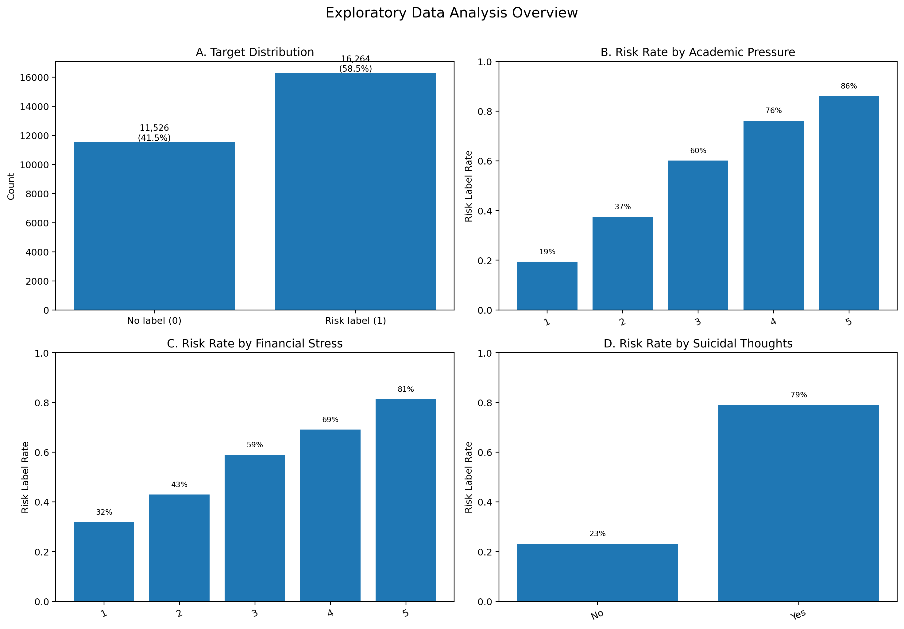
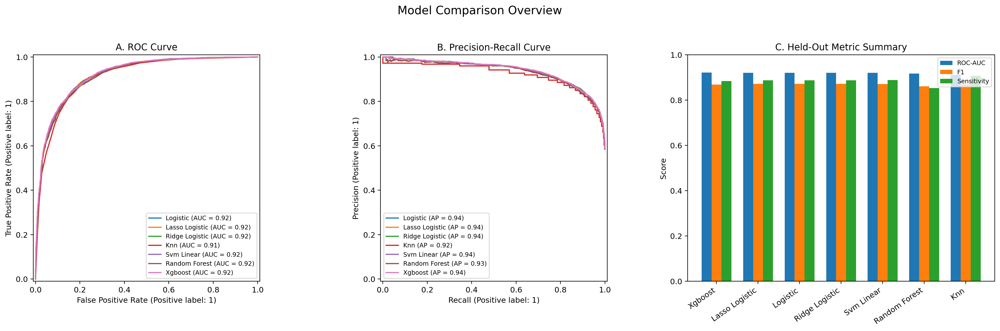
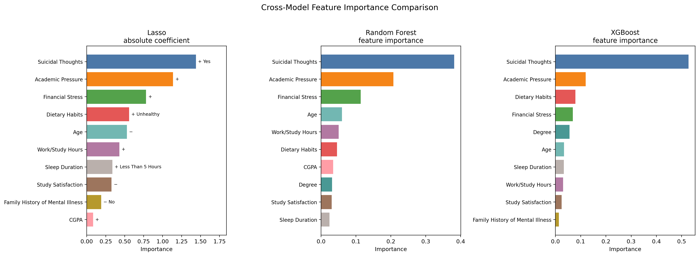

# Student Risk Screening ML Workflow

This project demonstrates a **complete tabular data analysis workflow** using the Kaggle Student Depression Dataset as a case study. The goal is not to claim expertise in psychology or to build a clinical diagnostic tool. The goal is to show how I approach a real-looking dataset: define the analysis population, clean ambiguous records, explore key patterns, compare models with proper validation, and interpret the variables selected by the models.

The central analytical question is:

> Given student-level demographic, academic, lifestyle, and pressure-related variables, can we build a reproducible binary classification workflow and identify which variables repeatedly act as predictive warning signs in this dataset?

## Responsible Use and Project Scope

This dataset is treated as a **synthetic case-study dataset** for machine learning practice. The output of this project should be interpreted as dataset-level predictive patterns, not medical evidence.

This project does **not** claim that:

- the model diagnoses depression,
- any variable causes depression,
- the findings directly generalize to real clinical populations.

A more appropriate interpretation is:

> In this dataset, certain student characteristics are repeatedly associated with a higher predicted risk label. In a real setting, such information should only be used to support awareness, care, and further professional evaluation, not to automatically label people.

## Analysis Story

The project is organized around a standard analysis pipeline:

```text
Raw data
→ define the analysis population
→ clean inconsistent or ambiguous records
→ inspect key descriptive patterns
→ split train/test data
→ tune models using cross-validation on the training set
→ evaluate final models on the held-out test set
→ compare feature signals across models
→ translate interpretable model coefficients into risk-oriented discussion
```

This structure is the main point of the repository. Models are not applied just to produce numbers; each step is used to support the next step in the analysis.

## Data Scope and Cleaning

The original dataset contains a small number of records that are inconsistent with the student-focused analysis or difficult to interpret. Since these records account for a very small share of the dataset, removal is preferred over imputation or forced interpretation.

| Cleaning rule | Reason |
|---|---|
| Keep only `Profession == Student` | The analysis is student-focused; non-student records are rare and scope-ambiguous. |
| Remove `CGPA == 0` | A zero CGPA is inconsistent with active student academic records. |
| Remove `Academic Pressure == 0` | Academic pressure is treated as an ordinal pressure score; zero is outside the meaningful scale used in the analysis. |
| Remove `Degree == Others` | The education category is ambiguous. |
| Remove `Dietary Habits == Others` and `Sleep Duration == Others` | These categories are rare and not interpretable. |
| Remove invalid `Financial Stress` values such as `?` | The value is not a valid numeric stress score. |
| Drop `City` | The project does not perform regional or spatial analysis. |
| Drop `id` | Identifier columns should not be used as predictive features. |

Cleaning summary:

| Item | Count |
|---|---:|
| Raw rows | 27,901 |
| Removed non-student rows | 31 |
| Removed CGPA = 0 rows | 9 |
| Removed Degree = Others rows | 35 |
| Removed Dietary Habits = Others rows | 12 |
| Removed Sleep Duration = Others rows | 18 |
| Removed Academic Pressure = 0 rows | 3 |
| Removed invalid Financial Stress rows | 3 |
| Final rows | 27,790 |
| Positive risk-label rate after cleaning | 58.5% |

The full cleaning report is saved in:

```text
reports/cleaning_report.csv
```

## Exploratory Data Analysis

EDA is not used here as decoration. It answers three basic questions before modeling:

1. **Is the target label usable for classification?**  
   The target distribution shows that both classes are present in meaningful proportions. The dataset is not a one-class or extremely imbalanced problem.

2. **Do pressure-related variables show visible gradients before modeling?**  
   Academic pressure and financial stress are selected because they are easy to explain, directly related to student burden, and later appear as important features across models.

3. **Do severe warning-sign variables separate the risk label?**  
   Suicidal thoughts are inspected because they represent a serious self-reported warning sign in the dataset. This is a descriptive check only, not a clinical conclusion.

The overview figure below combines these checks into one visual summary instead of interrupting the README with several separate plots.



The figure provides the first layer of the story: the risk label is not randomly scattered. Higher academic pressure and higher financial stress show visibly higher risk-label rates, and students reporting suicidal thoughts have a much higher risk-label rate in this dataset. These descriptive patterns motivate model-based comparison and interpretation in the next sections. Individual EDA figures are still saved under `reports/figures/` for detailed inspection.

## Modeling Strategy

The validation design is intentionally strict:

1. Split the cleaned data into training and test sets.
2. Use cross-validation and hyperparameter tuning only inside the training set.
3. Evaluate the selected models once on the held-out test set.

This prevents the test set from influencing tuning decisions.

The project compares interpretable linear models and more flexible machine-learning models:

| Model family | Models | Preprocessing |
|---|---|---|
| Linear / distance / margin models | Logistic Regression, Lasso Logistic, Ridge Logistic, KNN, Linear SVM | numeric imputation + standardization; categorical imputation + one-hot encoding |
| Tree-based models | Random Forest, XGBoost | numeric imputation without standardization; categorical imputation + one-hot encoding |

This separation matters because tree-based models do not need numeric standardization, while logistic regression, KNN, and SVM are more sensitive to feature scale.

## Results: Model Comparison

The best held-out ROC-AUC is from **XGBoost** (ROC-AUC = 0.922). The highest sensitivity is from **KNN** (sensitivity = 0.907).

However, the main finding is not simply “XGBoost wins.” The performance gap among XGBoost, Lasso Logistic, standard Logistic Regression, Ridge Logistic, and Linear SVM is small. This means the analysis should not stop at choosing one model. Since logistic models remain competitive, they are useful for interpreting how explanatory variables relate to the predicted risk label.

### Held-Out Test Performance

| Model               |   Accuracy |   ROC-AUC |   PR-AUC |   Sensitivity |   Specificity |   Precision |    F1 |
|:--------------------|-----------:|----------:|---------:|--------------:|--------------:|------------:|------:|
| XGBoost             |      0.844 |     0.922 |    0.939 |         0.884 |         0.787 |       0.854 | 0.869 |
| Lasso Logistic      |      0.848 |     0.921 |    0.938 |         0.887 |         0.793 |       0.858 | 0.872 |
| Logistic Regression |      0.848 |     0.921 |    0.938 |         0.888 |         0.791 |       0.857 | 0.872 |
| Ridge Logistic      |      0.848 |     0.921 |    0.938 |         0.888 |         0.791 |       0.857 | 0.872 |
| Linear SVM          |      0.846 |     0.921 |    0.938 |         0.889 |         0.786 |       0.854 | 0.871 |
| Random Forest       |      0.839 |     0.917 |    0.933 |         0.853 |         0.818 |       0.869 | 0.861 |
| KNN                 |      0.842 |     0.911 |    0.922 |         0.907 |         0.749 |       0.836 | 0.870 |

The models are evaluated from two perspectives: threshold-independent ranking performance and threshold-based screening trade-offs. The overview figure below combines ROC curves, precision-recall curves, and selected summary metrics.



The individual ROC, precision-recall, and metric-summary plots are also saved separately under `reports/figures/` for detailed inspection.

### How the Evaluation Metrics Are Read

The models are compared with multiple metrics because a single score cannot fully describe a risk-screening classifier.

| Metric | Meaning in this project |
|---|---|
| Accuracy | Overall proportion of correct predictions. Useful as a general summary, but not enough by itself. |
| ROC-AUC | Ability to rank risk-label cases above non-risk-label cases across thresholds. This is the main threshold-independent comparison metric. |
| PR-AUC | Precision-recall performance, useful when the positive class is especially important. |
| Sensitivity / Recall | Among students with the risk label, the proportion correctly detected. In a screening-style setting, this is important because missed high-risk cases are concerning. |
| Specificity | Among students without the risk label, the proportion correctly identified as non-risk. |
| Precision | Among students predicted as risk-label cases, the proportion that truly have the risk label. |
| F1 Score | Harmonic mean of precision and recall. Useful when balancing false positives and false negatives. |

The model choice is therefore not based only on one number. ROC-AUC and PR-AUC summarize ranking ability, sensitivity reflects screening coverage, and F1 balances precision and recall.


### Overall Model Assessment

The held-out results show that **XGBoost has the highest ROC-AUC**, while **KNN has the highest sensitivity**. However, the performance differences among XGBoost, Lasso Logistic, Logistic Regression, Ridge Logistic, and Linear SVM are small.

This leads to three practical conclusions:

1. **XGBoost is a strong predictive model** because it gives the best held-out ROC-AUC.
2. **KNN is useful as a high-sensitivity reference**, but its lower specificity means it flags more non-risk cases as risk cases.
3. **Logistic and Lasso Logistic remain important**, even if they are not always the single best model, because their performance is competitive and their coefficients can be translated into odds-ratio interpretations.

For this reason, the analysis does not simply choose one winning model and stop. It uses model comparison to evaluate predictive performance, then uses interpretable models and feature-importance methods to understand which variables are repeatedly selected as warning signs.


### Training-Set Cross-Validation

Cross-validation is performed only on the training set. The held-out test set is used once at the end to estimate final performance.

This table is used to check whether model performance is stable during training. Detailed selected hyperparameters are saved in `reports/cv_model_comparison.csv` rather than shown here, so the README can stay readable.

| Model | Best CV ROC-AUC | CV Std. |
|---|---:|---:|
| Lasso Logistic | 0.921 | 0.000 |
| Logistic Regression | 0.921 | 0.000 |
| Ridge Logistic | 0.921 | 0.000 |
| Linear SVM | 0.921 | 0.000 |
| XGBoost | 0.920 | 0.000 |
| Random Forest | 0.915 | 0.001 |
| KNN | 0.911 | 0.001 |

The top-performing linear models and XGBoost show very similar cross-validation ROC-AUC values, suggesting that the dataset has strong and stable predictive signals. Random Forest and KNN are still competitive, but their validation ROC-AUC values are slightly lower.


## From Prediction to Explanation

After comparing model performance, the next question is:

> Which explanatory variables are repeatedly selected as important, and how can they be interpreted?

This project uses two complementary views:

1. **Cross-model importance**: Lasso, Random Forest, and XGBoost are compared side by side to find repeated predictive signals.
2. **Logistic odds ratios**: Logistic regression is used to translate selected coefficients into an interpretable `exp(beta)` form.

## Cross-Model Feature Importance



The most consistent predictors across model families are **Suicidal Thoughts**, **Academic Pressure**, **Financial Stress**, **Dietary Habits**, **Sleep Duration**, **Study Satisfaction**, and **Work/Study Hours**. Since these variables appear repeatedly across linear and tree-based models, they are more convincing as dataset-level predictive signals than variables selected by only one model.

| Feature                          | Lasso | Random Forest | XGBoost | Models in Top 10 |
|:---------------------------------|:------|:--------------|:--------|-----------------:|
| Academic Pressure                | 2     | 2             | 2       | 3 |
| Age                              | 5     | 4             | 6       | 3 |
| Dietary Habits                   | 4     | 6             | 3       | 3 |
| Financial Stress                 | 3     | 3             | 4       | 3 |
| Sleep Duration                   | 7     | 10            | 7       | 3 |
| Study Satisfaction               | 8     | 9             | 9       | 3 |
| Suicidal Thoughts                | 1     | 1             | 1       | 3 |
| Work/Study Hours                 | 6     | 5             | 8       | 3 |
| CGPA                             | 10    | 7             |         | 2 |
| Degree                           |       | 8             | 5       | 2 |
| Family History of Mental Illness | 9     |               | 10      | 2 |

## Logistic Regression Odds-Ratio Interpretation

Logistic regression is useful because coefficients can be translated into odds ratios. For a coefficient beta, `exp(beta)` gives the multiplicative change in the odds of the risk label.

For this interpretation table, an auxiliary logistic model is fit with numeric variables kept on their original scale. Therefore:

- for numeric variables, `exp(beta)` means the odds multiplier for a **one-unit increase**, holding other variables fixed;
- for categorical variables, `exp(beta)` compares the displayed level with the reference level created during one-hot encoding.

| Feature           | Comparison                            | Direction   | Coefficient | Odds Ratio exp(beta) | Approx. odds change |
|:------------------|:--------------------------------------|:------------|------------:|:---------------------|:--------------------|
| Suicidal Thoughts | Yes vs. reference level               | Higher odds | 2.511 | 12.31x | +1131% |
| Dietary Habits    | Unhealthy vs. reference level         | Higher odds | 1.089 | 2.97x  | +197% |
| Academic Pressure | one-unit increase                     | Higher odds | 0.844 | 2.33x  | +133% |
| Financial Stress  | one-unit increase                     | Higher odds | 0.558 | 1.75x  | +75%  |
| Dietary Habits    | Moderate vs. reference level          | Higher odds | 0.493 | 1.64x  | +64%  |
| Degree            | LLB vs. reference level               | Higher odds | 0.414 | 1.51x  | +51%  |
| Sleep Duration    | Less Than 5 Hours vs. reference level | Higher odds | 0.384 | 1.47x  | +47%  |
| Degree            | MBBS vs. reference level              | Higher odds | 0.363 | 1.44x  | +44%  |

Examples of interpretation inside this dataset:

- A one-point increase in **Academic Pressure** multiplies the model-estimated odds of the risk label by about **2.33 times**, holding other variables fixed.
- A one-point increase in **Financial Stress** multiplies the odds by about **1.75 times**, holding other variables fixed.
- Students reporting **Suicidal Thoughts = Yes** have much higher model-estimated odds than the reference level in this dataset.
- **Less than 5 hours of sleep** is associated with higher predicted odds than the reference sleep-duration level.

These interpretations are useful because they connect the predictive model back to understandable student-level patterns. They are still associations learned from a synthetic dataset, not causal or clinical effects.

## Discussion

The analysis shows a coherent pattern: the variables most repeatedly selected by the models are related to academic burden, financial stress, self-reported suicidal thoughts, lifestyle habits, sleep, study satisfaction, and workload. This is exactly the type of result a risk-screening workflow should surface: not just a predicted label, but a set of interpretable warning signs.

From a practical and human perspective, the result suggests that student mental well-being is a topic that deserves attention. In real life, students facing strong academic pressure, financial stress, poor sleep, unhealthy daily routines, or suicidal thoughts should not be reduced to a model score. These signs should prompt care, conversation, and professional support when needed.

A responsible use of this type of analysis would be:

- to identify broad patterns worth monitoring,
- to support early awareness and discussion,
- to encourage supportive intervention rather than judgment,
- to remind people to pay attention when friends show serious distress or repeatedly mention pressure, hopelessness, or self-harm-related thoughts.

The project therefore demonstrates both technical workflow design and responsible interpretation: the model helps organize evidence, but human care and professional judgment remain essential.

## Limitations

- The dataset is synthetic, so results should not be treated as real-world clinical evidence.
- The analysis is predictive, not causal.
- Feature importance can change with preprocessing, model choice, and sampling variation.
- The project does not perform clinical validation, fairness assessment, or external validation.
- City is intentionally excluded because the project does not attempt regional analysis.
- The odds-ratio table is designed for interpretation; it should be read as model-based association, not as a causal effect.

## How to Run

Install dependencies:

```bash
pip install -r requirements.txt
```

Run the full workflow:

```bash
python main.py
```

Run tests:

```bash
python -m pytest
```

Generated outputs appear under:

```text
reports/
reports/figures/
```

## Repository Structure

```text
student-risk-screening-ml-workflow/
├── README.md
├── requirements.txt
├── main.py
├── data/
│   ├── raw/
│   └── processed/
├── src/
│   ├── cleaning.py
│   ├── data_loader.py
│   ├── eda.py
│   ├── feature_display.py
│   ├── interpretation.py
│   ├── modeling.py
│   ├── reporting.py
│   └── visualization.py
├── reports/
│   └── figures/
└── tests/
    └── test_pipeline.py
```

## Skills Demonstrated

- Defining a clear analysis population
- Cleaning ambiguous and inconsistent records
- Designing EDA around specific analytical questions
- Building a reproducible train/test + cross-validation workflow
- Comparing models with multiple metrics instead of accuracy alone
- Separating preprocessing strategies by model family
- Interpreting both feature importance and logistic odds ratios
- Communicating results responsibly for a non-technical audience
