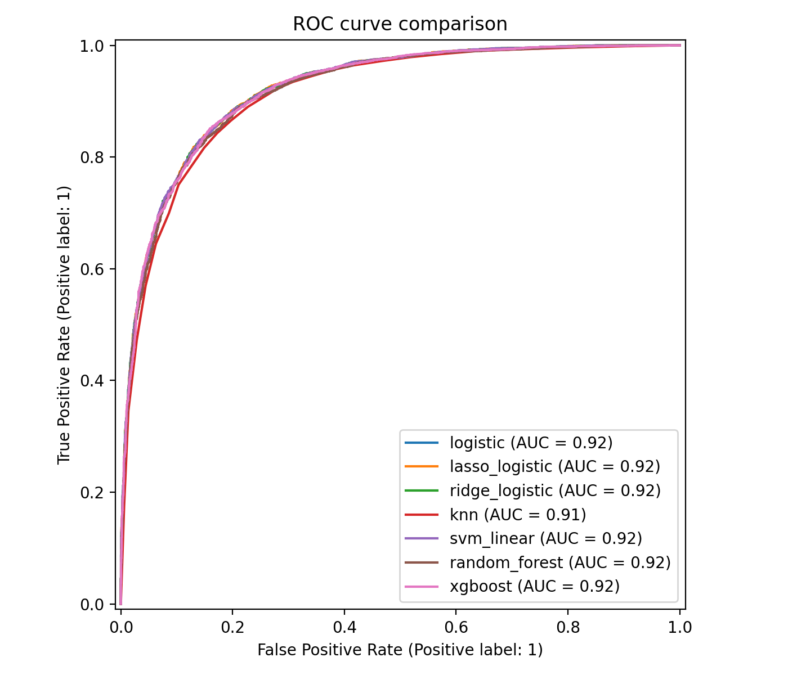
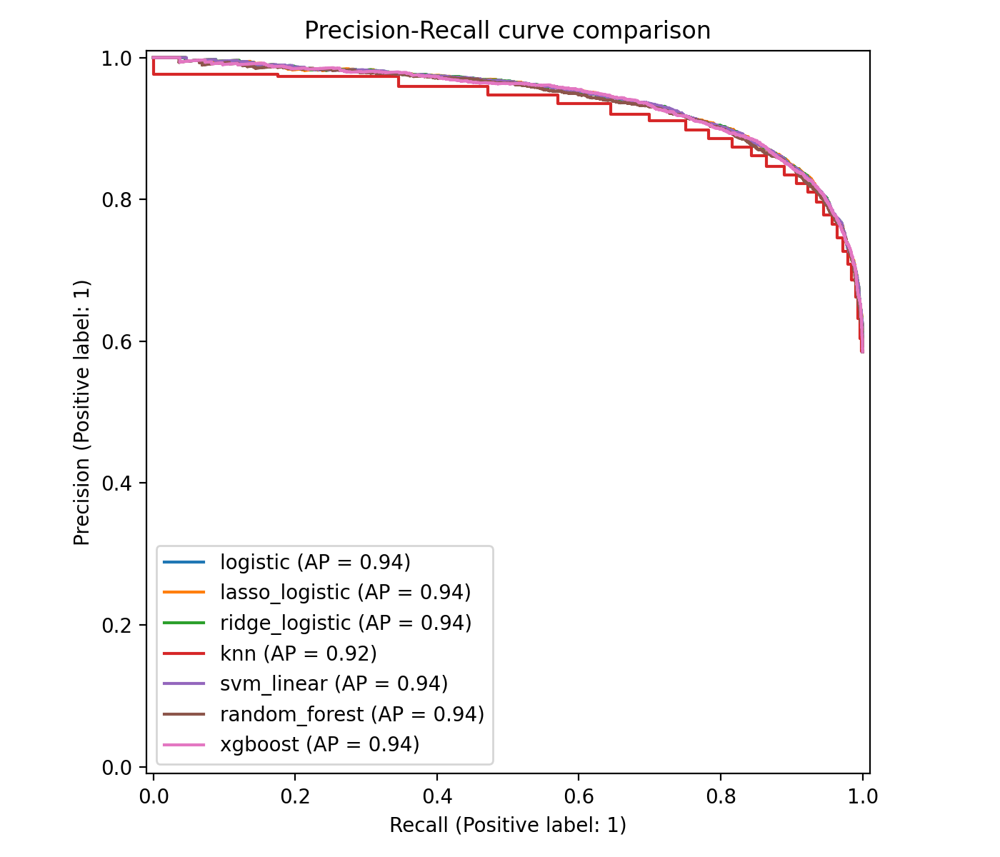
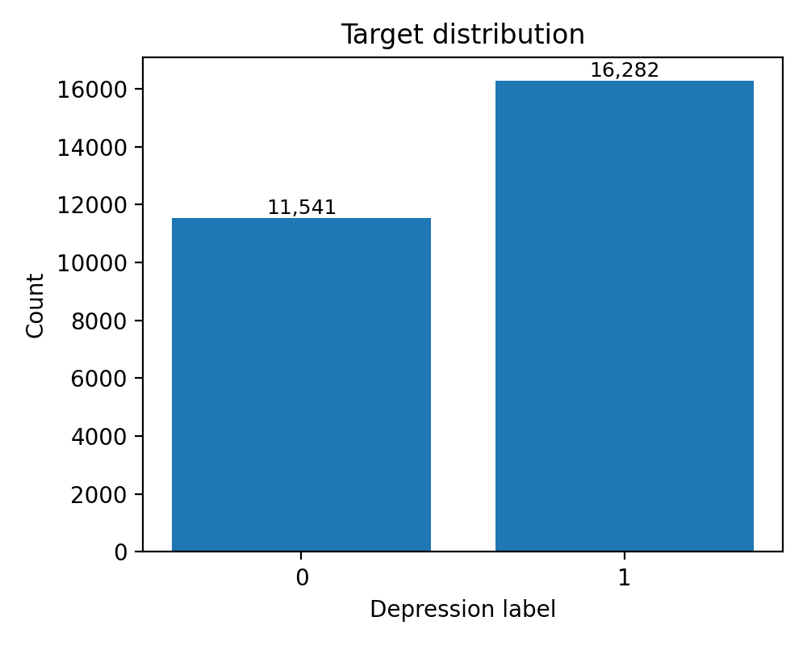
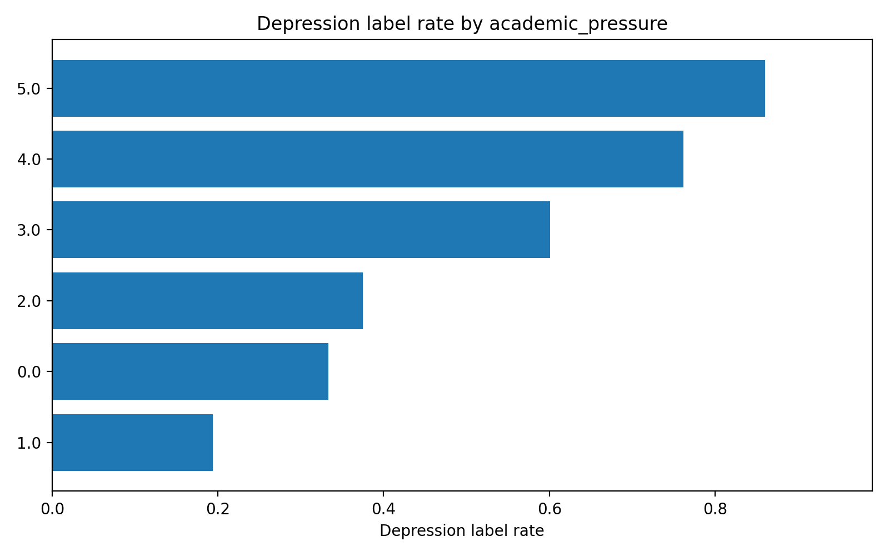
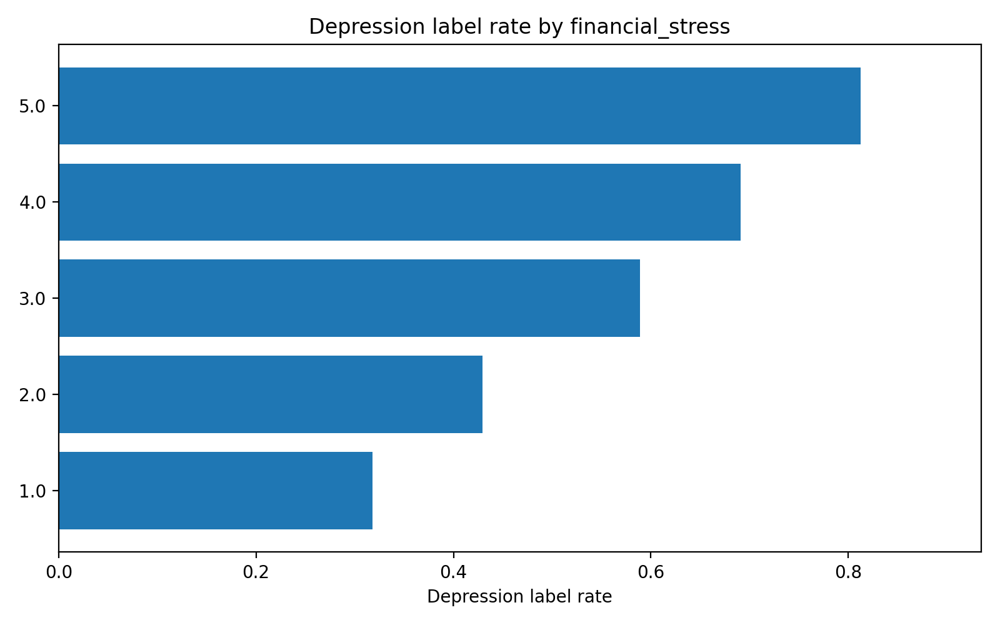
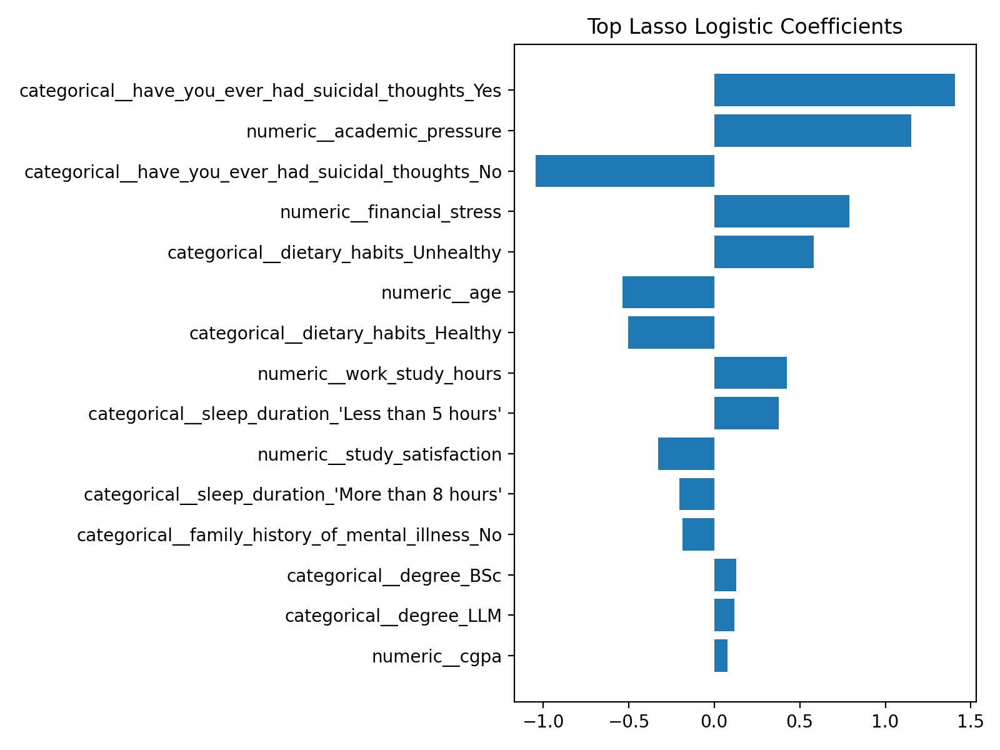
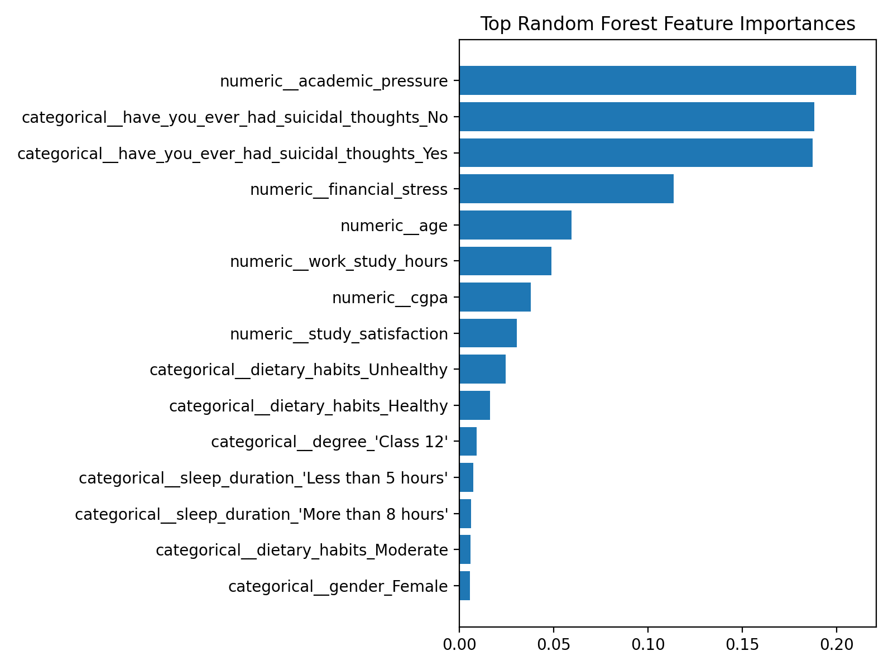
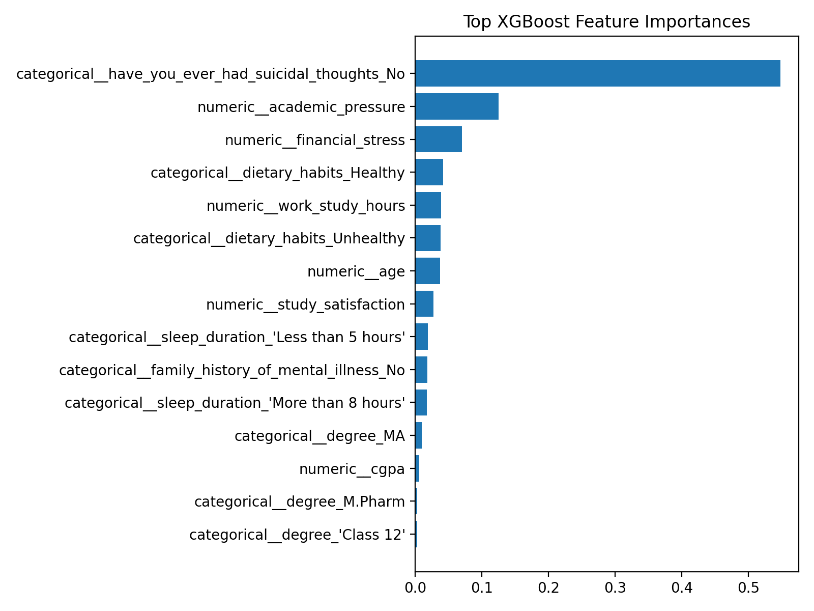
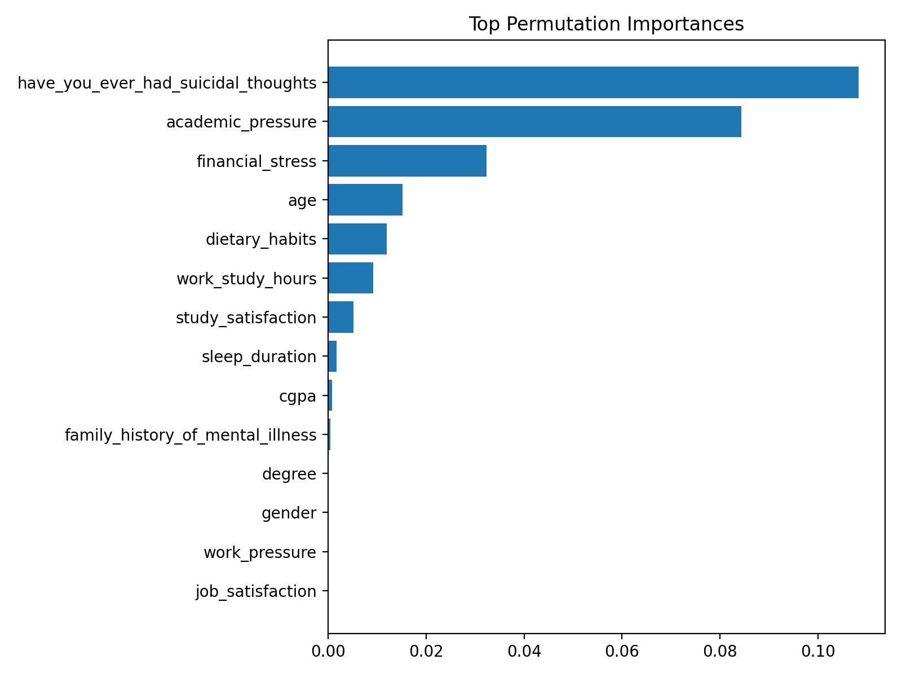

# Student Risk Screening ML Workflow

An end-to-end machine learning workflow for **tabular binary classification**, using the Kaggle Student Depression Dataset as a case study.

This repository is not a clinical or psychological study. The goal is to demonstrate a reproducible data analysis workflow: define an analysis scope, clean ambiguous records, compare models correctly, evaluate beyond accuracy, and interpret predictive signals responsibly.

## Project Summary

This project uses a synthetic student mental-health dataset as a case study for a general **risk-screening machine learning workflow**.

The main emphasis is the analysis process:

```text
Raw data
→ scope and anomaly cleaning
→ exploratory data analysis
→ stratified train/test split
→ cross-validation on the training set
→ held-out test evaluation
→ feature interpretation
→ responsible discussion
```

The dataset context is student depression, but the project is designed to show transferable data analysis skills for tabular binary classification problems such as churn prediction, defect screening, credit default, or risk flagging.

---

## Dataset and Scope

Raw data path:

```text
data/raw/student_depression_dataset.csv
```

Target column:

```text
Depression
```

The dataset is treated as a **synthetic case-study dataset** rather than a clinical survey. Results should be interpreted as predictive patterns inside this dataset, not as medical conclusions.

### Cleaning Rules

The analysis population is restricted to records that are consistent with the student-focused project scope.

| Rule | Reason |
|---|---|
| Keep only `Profession == Student` | The project scope is student risk screening |
| Remove `CGPA == 0` | A zero CGPA is inconsistent with active student academic variables |
| Remove `Degree == Others` | The category is ambiguous and very rare |
| Remove invalid `Financial Stress` values such as `?` | The value is not a valid numeric stress score |
| Drop `City` | The project does not perform regional or spatial analysis |
| Drop `id` | Identifier columns should not be predictive features |

These cleaning decisions are intentionally conservative because the affected records are rare and ambiguous.

The cleaning counts are written to:

```text
reports/cleaning_report.csv
```

---

## Modeling Design

The workflow uses a held-out test set correctly:

```text
1. Split cleaned data into training and test sets.
2. Run cross-validation and hyperparameter tuning only on the training set.
3. Evaluate selected models once on the held-out test set.
```

### Model-Specific Preprocessing

Different model families use different preprocessing.

| Models | Preprocessing |
|---|---|
| Logistic, Lasso Logistic, Ridge Logistic, KNN, Linear SVM | numeric imputation + standardization, categorical imputation + one-hot encoding |
| Random Forest, XGBoost | numeric imputation without standardization, categorical imputation + one-hot encoding |

Tree models do not need numeric standardization, but categorical text variables still need encoding in the sklearn workflow.

### Models Compared

- Logistic Regression
- L1-regularized Logistic Regression
- L2-regularized Logistic Regression
- KNN
- Linear SVM
- Random Forest
- XGBoost

### Evaluation Metrics

The held-out test report includes:

- Accuracy
- ROC-AUC
- PR-AUC
- Sensitivity / Recall
- Specificity
- Precision
- F1 score

Sensitivity is included because false negatives matter in screening-style tasks. This repository still does not make clinical recommendations.

---

## Model Performance

Held-out test performance after training-set cross-validation tuning:

| model | accuracy | roc_auc | pr_auc | sensitivity / recall | specificity | precision | f1 |
|---|---:|---:|---:|---:|---:|---:|---:|
| lasso_logistic | 0.849 | 0.923 | 0.940 | 0.886 | 0.797 | 0.860 | 0.873 |
| svm_linear | 0.849 | 0.923 | 0.940 | 0.887 | 0.795 | 0.859 | 0.873 |
| logistic | 0.848 | 0.922 | 0.940 | 0.885 | 0.796 | 0.860 | 0.872 |
| ridge_logistic | 0.848 | 0.922 | 0.940 | 0.885 | 0.796 | 0.860 | 0.872 |
| xgboost | 0.846 | 0.921 | 0.939 | 0.889 | 0.784 | 0.853 | 0.871 |
| random_forest | 0.840 | 0.919 | 0.937 | 0.851 | 0.824 | 0.872 | 0.861 |
| knn | 0.840 | 0.913 | 0.925 | 0.907 | 0.746 | 0.834 | 0.869 |

The linear models and linear SVM produce the strongest overall ROC-AUC. KNN has the highest sensitivity, but it trades off specificity. This is a useful screening-style comparison because different model choices imply different false-negative and false-positive behavior.

### Cross-Validation Stability

| model | best CV ROC-AUC | CV std. ROC-AUC | selected parameters |
|---|---:|---:|---|
| lasso_logistic | 0.921 | 0.002 | `C=0.1` |
| logistic | 0.921 | 0.003 | `C=0.1` |
| ridge_logistic | 0.921 | 0.003 | `C=0.1` |
| svm_linear | 0.920 | 0.003 | `C=0.1` |
| xgboost | 0.918 | 0.002 | `n_estimators=100`, `max_depth=3`, `learning_rate=0.05` |
| random_forest | 0.915 | 0.002 | `n_estimators=120`, `min_samples_leaf=5` |
| knn | 0.909 | 0.002 | `n_neighbors=25` |





---

## Exploratory Analysis

The EDA stage checks target balance, missing values, numeric relationships, and target-rate differences across selected variables.







---

## Important Predictive Features

Feature importance results are interpreted as **predictive signals**, not causes.

### Lasso Logistic Coefficients

| feature | coefficient |
|---|---:|
| suicidal thoughts = No | -1.228 |
| suicidal thoughts = Yes | 1.224 |
| academic pressure | 1.151 |
| financial stress | 0.790 |
| dietary habits = Unhealthy | 0.581 |
| age | -0.535 |
| dietary habits = Healthy | -0.501 |
| work/study hours | 0.426 |
| sleep duration = Less than 5 hours | 0.376 |
| study satisfaction | -0.327 |



### Tree-Based and Permutation Importance

Across Random Forest, XGBoost, and permutation importance, the most consistent predictive signals include:

- suicidal-thoughts-related variables
- academic pressure
- financial stress
- age
- dietary habits
- work/study hours
- study satisfaction







---

## Discussion

This project is designed to show a reproducible analysis process rather than domain expertise in depression.

Main observations:

1. **Model comparison beyond accuracy**  
   ROC-AUC, PR-AUC, sensitivity, specificity, precision, and F1 are compared together. This avoids choosing a model only because it has high accuracy.

2. **Screening-style trade-off**  
   KNN has the highest sensitivity but lower specificity. Linear models have stronger overall ROC-AUC. This shows why evaluation depends on the decision context.

3. **Interpretability from multiple angles**  
   Lasso coefficients, tree-based feature importance, and permutation importance are compared to identify robust predictive signals.

4. **Responsible interpretation**  
   The dataset is synthetic and the target is sensitive. Therefore, the project does not claim clinical validity or causal relationships.

---

## How to Run

Install dependencies:

```bash
pip install -r requirements.txt
```

Run the full workflow:

```bash
python main.py
```

Run tests:

```bash
python -m pytest
```

Generated outputs appear under:

```text
reports/
reports/figures/
```

The script also creates:

```text
reports/readme_results.md
```

which contains README-ready Markdown tables generated from the latest run.

---

## Repository Structure

```text
student-risk-screening-ml-workflow/
├── README.md
├── requirements.txt
├── main.py
├── data/
│   ├── raw/
│   └── processed/
├── src/
│   ├── cleaning.py
│   ├── data_loader.py
│   ├── eda.py
│   ├── interpretation.py
│   ├── modeling.py
│   ├── reporting.py
│   └── visualization.py
├── reports/
│   └── figures/
└── tests/
    └── test_pipeline.py
```

## Responsible Interpretation

Feature importance and model coefficients should be interpreted as predictive signals or correlates in this dataset. They should not be interpreted as causal effects.

This project is for machine learning workflow demonstration only and is not intended for diagnosis, treatment, or mental-health decision-making.
